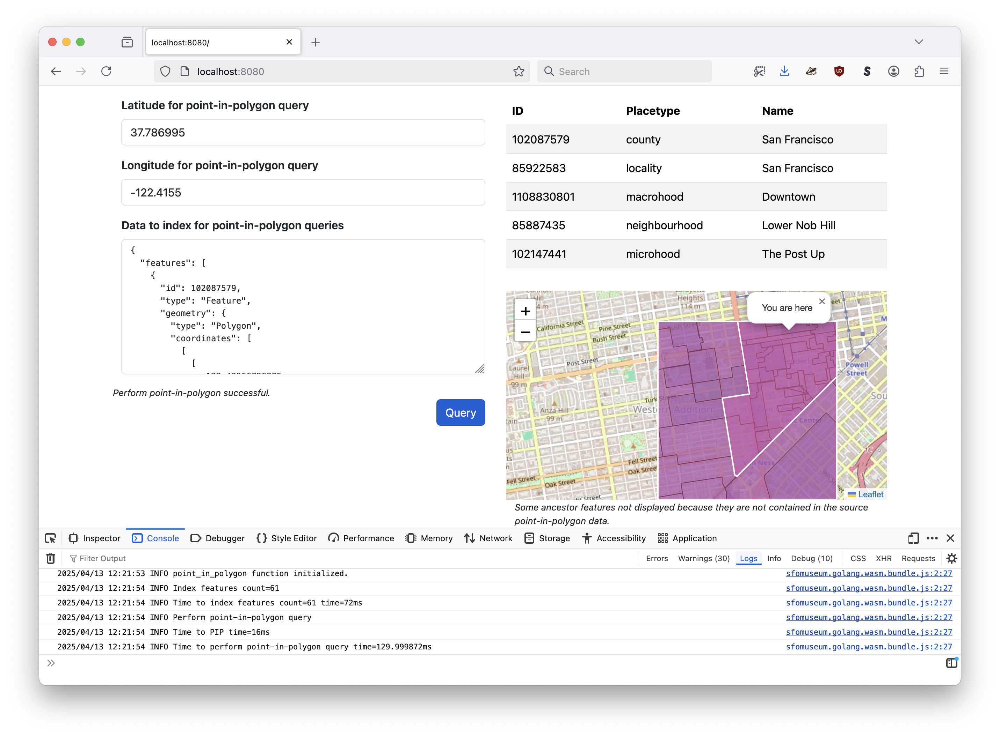
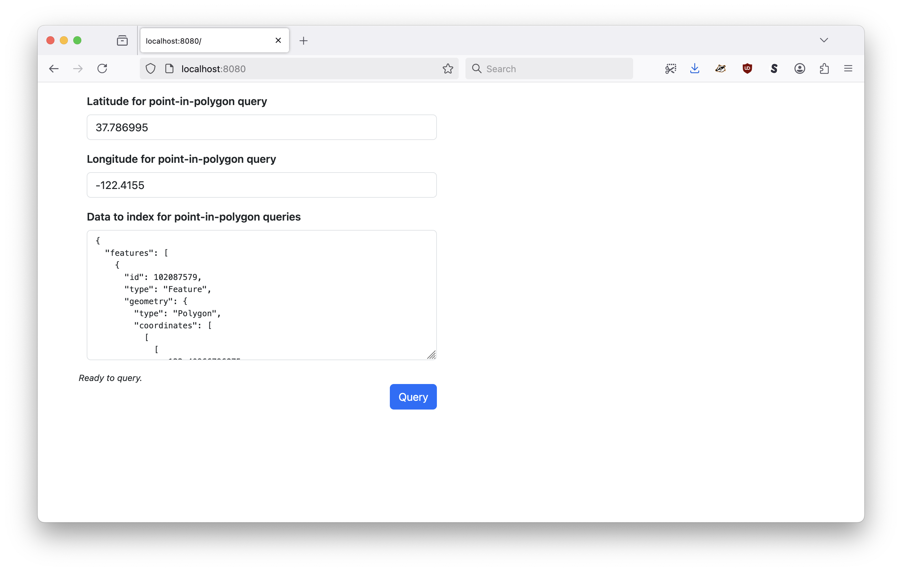

# go-whosonfirst-spatial-wasm



Go package to build a WebAssembly (WASM) binary that provides an in-memory point-in-polygon service.

## Motivation

This package builds a WebAssembly (WASM) binary that provides an in-memory point-in-polygon service. Under the hood it is using the [whosonfirst/go-whosonfirst-spatial/database.SpatialDatabase](https://pkg.go.dev/github.com/whosonfirst/go-whosonfirst-spatial/database#RTreeSpatialDatabase) package.

It is designed to be used with small (or at least smaller-than-larger) datasets which are indexed and queried at runtime. For example the output of the [whosonfirst/go-whosonfirst-spatial-www "point-in-polygon-with-tile"](https://github.com/whosonfirst/go-whosonfirst-spatial-www/tree/main/cmd/server#point-in-polygon-with-tile) endpoint which returns (Who's On First) records intersecting with and trimmed to the boundaries of a map tile.

The "point-in-polygon-with-tile" endpoint exists as a way to allow a client to specify enough data to perform a point-in-polygon operation locally without having to send precise coordinate data to a remote actor.

The `point_in_polygon.wasm` WASM binary it a compliment to that endpoint (and others like it) allowing the final point-in-polygon operation to happen locally.

## Install

```
$> git clone git@github.com:whosonfirst/go-whosonfirst-spatial-wasm.git
```

This package comes with a pre-built `point_in_polygon.wasm` binary which is bundled using Git LFS. Depending on how your Git setup is configured you may need to do extra "git things" to download it. You probably won't but Git is still weird that way.

## Building

As mentioned there is already a pre-built WASM binary but if you need or want to rebuild it use the handy `wasm` Makefile target:

```
$> make wasm
GOOS=js GOARCH=wasm go build -mod vendor -ldflags="-s -w" -o www/wasm/point_in_polygon.wasm cmd/point-in-polygon/main.go
```

This will create a new WebAssembly (WASM) binary in `www/wasm/point_in_polygon.wasm`.

## Usage

This example uses the [sfomuseum/js-sfomuseum-golang-wasm](https://github.com/sfomuseum/js-sfomuseum-golang-wasm) package for loading WebAssembly binaries in JavaScript. There are other ways to do the same thing. This is just the one I like.

```
sfomuseum.golang.wasm.fetch("wasm/point_in_polygon.wasm").then((rsp) => {

	var pip_data;	// This is up to you. Should be a GeoJSON FeatureCollection of Who's On First style documents.

	var lon;	// The longitude to use for a point-in-polygon query.
	var lat;	// The latitude to use for a point-in-polygon query.
	
	var geom = {
	    type: "Point",
	    coordinates: [ lon, lat ]
	};

	// Pass in a go-whosonfirst-spatial/query.SpatialQuery blob (geometry is the only required field)
	// https://pkg.go.dev/github.com/whosonfirst/go-whosonfirst-spatial/query#SpatialQuery
	
	var spatial_q = {
	    geometry: geom,
	    sort: [
		"placetype://"
	    ]
	};

	point_in_polygon(JSON.stringify(pip_data), JSON.stringify(spatial_q)).then((str_rsp) => {

		const rsp = JSON.parse(str_rsp);
		// Do something with rsp here
		
	}).catch((err) => {
		console.error("Failed to perform point-in-polygon query", err);
	});
	
}).catch((err) => {
	console.error("Failed to load point_in_polygon.wasm", err);	       
});
```

### Input

The `point_in_polygon` function expects two input parameters:

1. A JSON-encoded GeoJSON FeatureCollection of Who's On First style records to index (in the in-memory spatial database).
2. A JSON-encoded [go-whosonfirst-spatial/query.SpatialQuery](https://pkg.go.dev/github.com/whosonfirst/go-whosonfirst-spatial/query#SpatialQuery) data structure containing criteria for the point-in-polygon operation itself.

## Example

There is a working example in the [www](www) directory. You will need to run it using the web server of choice. I like using [aaronland/go-http-fileserver](https://github.com/aaronland/go-http-fileserver) but that's just because I wrote it. You can use anything you want. For example:

```
$> fileserver -root www/
2025/04/13 11:46:46 Serving www/ and listening for requests on http://localhost:8080
```

Then when you open your web browser to `http://localhost:8080` you should see this:



This demo loads default point-in-polygon and coordinate data to query for so all you need to do is click the `Query` button and you should see this:


You can test the WASM binary but change the value in the form and clicking the `Query` button again.

## See also

* https://github.com/whosonfirst/go-whosonfirst-spatial
* https://github.com/sfomuseum/js-sfomuseum-golang-wasm